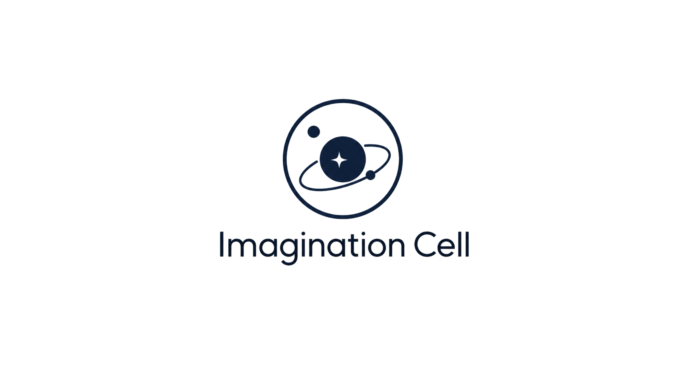


---

# Imagination Cell

> **Imagination Cell** is an independent developer focused on creating creative, accessible, and user-friendly digital experiences. By combining technology with imagination, we strive to build products that are simple, engaging, and meaningful for a wide range of users.

## Profile

- Name: **Imagination Cell**
- Domain: game development, gameplay design, and technical documentation
- Approach: structured, professional, and results-oriented

## Game Development Focus

- Game design planning
- Gameplay mechanics development
- Visual and audio asset integration
- Game performance optimization
- Game project architecture documentation

## Repository Purpose

This repository serves as project documentation. Most of the core content is private, while this public repository provides:

- game design summaries
- technical documentation
- development and architecture guides
- version notes and production process records

## Work Approach

Documentation is prepared to support a consistent, measurable, and reviewable game development process. The information structure is designed to facilitate project management, team coordination, and future reference.

## Contact

For inquiries related to game development or project collaboration, please reach out via GitHub or email at [imaginationcell.dev@gmail.com](mailto:imaginationcell.dev@gmail.com). The focus is on professional collaboration and high-quality game projects.
